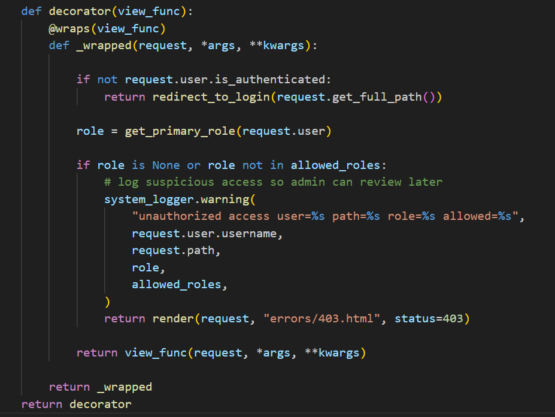

***Brief Explanation :***
decorator in BestieCare = function wrap another function it run first before actual view
check login + role first
if fail: block access
if pass: run original view

## Role-Based Decorator (BestieCare)

```python
def decorator(view_func):
    # this is main decorator function
    # it receive the original view function (like Django view)
    # view_func is the function we want to protect

    @wraps(view_func)
    # this keep original function name and info

    def _wrapped(request, *args, **kwargs):
        # this is wrapper function
        # wrapper will run INSTEAD of original function first
        # *args = catch all normal values
        # **kwargs = catch all named values
        # so wrapper can support ANY view function (flexible design)

        if not request.user.is_authenticated:
            # check if user not login
            # if not login, do not allow access
            return redirect_to_login(request.get_full_path())
            # redirect user to login page
            # this is first security layer

        role = get_primary_role(request.user)
        # get user role (Customer, Cleaner, Admin, etc)
        # abstraction: separate function handle role logic

        if role is None or role not in allowed_roles:
            # check if role not exist OR not allowed
            # this is authorization check (RBAC)

            # log suspicious access so admin can review later
            system_logger.warning(
                "unauthorized access user=%s path=%s role=%s allowed=%s",
                request.user.username,
                request.path,
                role,
                allowed_roles,
            )
            # log for security monitoring (important in real system)

            return render(request, "errors/403.html", status=403)
            # show forbidden page (403 error)
            # stop execution here, do not go to actual view

        return view_func(request, *args, **kwargs)
        # if all check passed
        # now call the original view function
        # this is the ONLY place original function execute

    return _wrapped
    # decorator return the wrapper function
    # so Django will use _wrapped instead of original view
